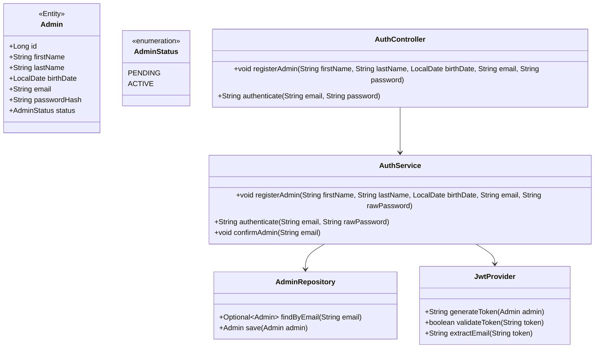

```mermaid
classDiagram

class Admin {
  <<Entity>>
  +Long id
  +String firstName
  +String lastName
  +LocalDate birthDate
  +String email
  +String passwordHash
  +AdminStatus status
}

class AdminStatus {
  <<enumeration>>
  PENDING
  ACTIVE
}

class AuthController {
  +void registerAdmin(String firstName, String lastName, LocalDate birthDate, String email, String password)
  +String authenticate(String email, String password)
}

class AuthService {
  +void registerAdmin(String firstName, String lastName, LocalDate birthDate, String email, String rawPassword)
  +String authenticate(String email, String rawPassword)
  +void confirmAdmin(String email)
}

class AdminRepository {
  +Optional~Admin~ findByEmail(String email)
  +Admin save(Admin admin)
}

class JwtProvider {
  +String generateToken(Admin admin)
  +boolean validateToken(String token)
  +String extractEmail(String token)
}

AuthController --> AuthService
AuthService --> AdminRepository
AuthService --> JwtProvider
```