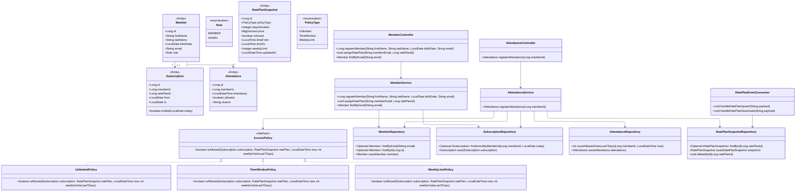

```mermaid
---
config:
  layout: elk
---
classDiagram

class Member {
  <<Entity>>
  +Long id
  +String firstName
  +String lastName
  +LocalDate birthDate
  +String email
  +Role role
}

class Role {
  <<enumeration>>
  MEMBER
  ADMIN
}

class Subscription {
  <<Entity>>
  +Long id
  +Long memberId
  +Long ratePlanId
  +LocalDate from
  +LocalDate to
  +boolean isValid(LocalDate today)
}

class Attendance {
  <<Entity>>
  +Long id
  +Long memberId
  +LocalDateTime timestamp
  +boolean allowed
  +String reason
}

class RatePlanSnapshot {
  <<Entity>>
  +Long id
  +PolicyType policyType
  +Integer daysDuration
  +BigDecimal price
  +boolean isActual
  +LocalTime timeFrom
  +LocalTime timeTo
  +Integer weeklyLimit
  +LocalDateTime updatedAt
}

class PolicyType {
  <<enumeration>>
  Unlimited
  TimeWindow
  WeeklyLimit
}

class AccessPolicy {
  <<interface>>
  +boolean isAllowed(Subscription subscription, RatePlanSnapshot ratePlan, LocalDateTime now, int weeklyVisitsLast7Days)
}

class UnlimitedPolicy {
  +boolean isAllowed(Subscription subscription, RatePlanSnapshot ratePlan, LocalDateTime now, int weeklyVisitsLast7Days)
}

class TimeWindowPolicy {
  +boolean isAllowed(Subscription subscription, RatePlanSnapshot ratePlan, LocalDateTime now, int weeklyVisitsLast7Days)
}

class WeeklyLimitPolicy {
  +boolean isAllowed(Subscription subscription, RatePlanSnapshot ratePlan, LocalDateTime now, int weeklyVisitsLast7Days)
}

AccessPolicy <|.. UnlimitedPolicy
AccessPolicy <|.. TimeWindowPolicy
AccessPolicy <|.. WeeklyLimitPolicy

class MemberController {
  +Long registerMember(String firstName, String lastName, LocalDate birthDate, String email)
  +void assignRatePlan(String memberEmail, Long ratePlanId)
  +Member findByEmail(String email)
}

class AttendanceController {
  +Attendance registerAttendance(Long memberId)
}

class MemberService {
  +Long registerMember(String firstName, String lastName, LocalDate birthDate, String email)
  +void assignRatePlan(String memberEmail, Long ratePlanId)
  +Member findByEmail(String email)
}

class AttendanceService {
  +Attendance registerAttendance(Long memberId)
}

class MemberRepository {
  +Optional~Member~ findByEmail(String email)
  +Optional~Member~ findById(Long id)
  +Member save(Member member)
}

class SubscriptionRepository {
  +Optional~Subscription~ findActiveByMemberId(Long memberId, LocalDate today)
  +Subscription save(Subscription subscription)
}

class AttendanceRepository {
  +int countAllowedVisitsLast7Days(Long memberId, LocalDateTime now)
  +Attendance save(Attendance attendance)
}

class RatePlanSnapshotRepository {
  +Optional~RatePlanSnapshot~ findById(Long ratePlanId)
  +RatePlanSnapshot save(RatePlanSnapshot snapshot)
  +void deleteById(Long ratePlanId)
}

class RatePlanEventConsumer {
  +void handleRatePlanUpsert(String payload)
  +void handleRatePlanDeactivate(String payload)
}


MemberController --> MemberService
AttendanceController --> AttendanceService

MemberService --> MemberRepository
MemberService --> SubscriptionRepository

AttendanceService --> MemberRepository
AttendanceService --> SubscriptionRepository
AttendanceService --> AttendanceRepository
AttendanceService --> RatePlanSnapshotRepository
AttendanceService --> AccessPolicy

RatePlanEventConsumer --> RatePlanSnapshotRepository

Member "1" --> "0..1" Subscription
Member "1" --> "0..*" Attendance
```