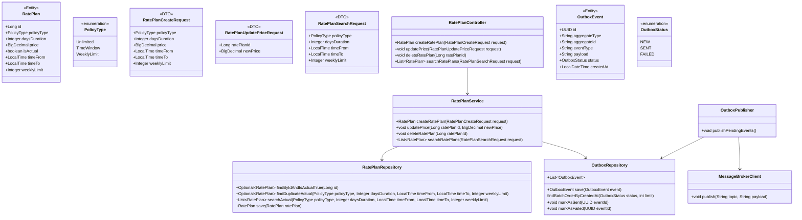

```mermaid
classDiagram

class RatePlan {
  <<Entity>>
  +Long id
  +PolicyType policyType
  +Integer daysDuration
  +BigDecimal price
  +boolean isActual
  +LocalTime timeFrom
  +LocalTime timeTo
  +Integer weeklyLimit
}

class PolicyType {
  <<enumeration>>
  Unlimited
  TimeWindow
  WeeklyLimit
}

class RatePlanCreateRequest {
  <<DTO>>
  +PolicyType policyType
  +Integer daysDuration
  +BigDecimal price
  +LocalTime timeFrom
  +LocalTime timeTo
  +Integer weeklyLimit
}

class RatePlanUpdatePriceRequest {
  <<DTO>>
  +Long ratePlanId
  +BigDecimal newPrice
}

class RatePlanSearchRequest {
  <<DTO>>
  +PolicyType policyType
  +Integer daysDuration
  +LocalTime timeFrom
  +LocalTime timeTo
  +Integer weeklyLimit
}

class RatePlanController {
  +RatePlan createRatePlan(RatePlanCreateRequest request)
  +void updatePrice(RatePlanUpdatePriceRequest request)
  +void deleteRatePlan(Long ratePlanId)
  +List~RatePlan~ searchRatePlans(RatePlanSearchRequest request)
}

class RatePlanService {
  +RatePlan createRatePlan(RatePlanCreateRequest request)
  +void updatePrice(Long ratePlanId, BigDecimal newPrice)
  +void deleteRatePlan(Long ratePlanId)
  +List~RatePlan~ searchRatePlans(RatePlanSearchRequest request)
}

class RatePlanRepository {
  +Optional~RatePlan~ findByIdAndIsActualTrue(Long id)
  +Optional~RatePlan~ findDuplicateActual(PolicyType policyType, Integer daysDuration, LocalTime timeFrom, LocalTime timeTo, Integer weeklyLimit)
  +List~RatePlan~ searchActual(PolicyType policyType, Integer daysDuration, LocalTime timeFrom, LocalTime timeTo, Integer weeklyLimit)
  +RatePlan save(RatePlan ratePlan)
}

class OutboxEvent {
  <<Entity>>
  +UUID id
  +String aggregateType
  +String aggregateId
  +String eventType
  +String payload
  +OutboxStatus status
  +LocalDateTime createdAt
}

class OutboxStatus {
  <<enumeration>>
  NEW
  SENT
  FAILED
}

class OutboxRepository {
  +OutboxEvent save(OutboxEvent event)
  +List~OutboxEvent~
  findBatchOrderByCreatedAt(OutboxStatus status, int limit)
  +void markAsSent(UUID eventId)
  +void markAsFailed(UUID eventId)
}

class OutboxPublisher {
  +void publishPendingEvents()
}

class MessageBrokerClient {
  +void publish(String topic, String payload)
}

RatePlanController --> RatePlanService
RatePlanService --> RatePlanRepository
RatePlanService --> OutboxRepository

OutboxPublisher --> OutboxRepository
OutboxPublisher --> MessageBrokerClient
```