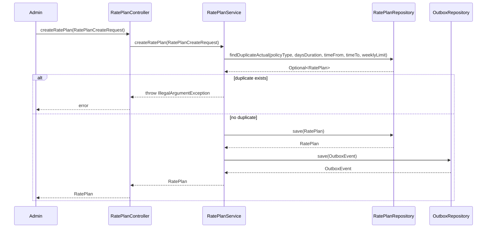

```mermaid
sequenceDiagram

participant Admin
participant RatePlanController
participant RatePlanService
participant RatePlanRepository
participant OutboxRepository

Admin->>RatePlanController: createRatePlan(RatePlanCreateRequest)

RatePlanController->>RatePlanService: createRatePlan(RatePlanCreateRequest)

RatePlanService->>RatePlanRepository: findDuplicateActual(policyType, daysDuration, timeFrom, timeTo, weeklyLimit)
RatePlanRepository-->>RatePlanService: Optional<RatePlan>

alt duplicate exists
    RatePlanService-->>RatePlanController: throw IllegalArgumentException
    RatePlanController-->>Admin: error
else no duplicate
    RatePlanService->>RatePlanRepository: save(RatePlan)
    RatePlanRepository-->>RatePlanService: RatePlan

    RatePlanService->>OutboxRepository: save(OutboxEvent)

    OutboxRepository-->>RatePlanService: OutboxEvent

    RatePlanService-->>RatePlanController: RatePlan
    RatePlanController-->>Admin: RatePlan
end
```