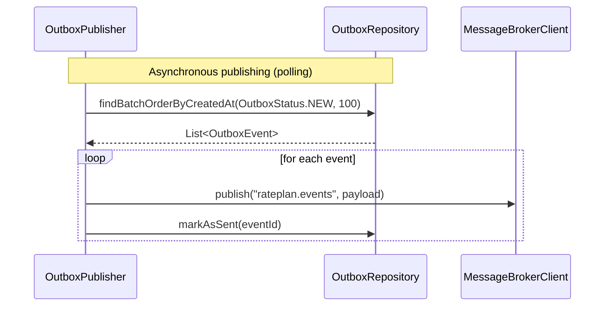

```mermaid
sequenceDiagram

participant OutboxPublisher
participant OutboxRepository
participant MessageBrokerClient


Note over OutboxPublisher,OutboxRepository: Asynchronous publishing (polling)

OutboxPublisher->>OutboxRepository: findBatchOrderByCreatedAt(OutboxStatus.NEW, 100)
OutboxRepository-->>OutboxPublisher: List<OutboxEvent>

loop for each event
    OutboxPublisher->>MessageBrokerClient: publish("rateplan.events", payload)
    OutboxPublisher->>OutboxRepository: markAsSent(eventId)
end
```