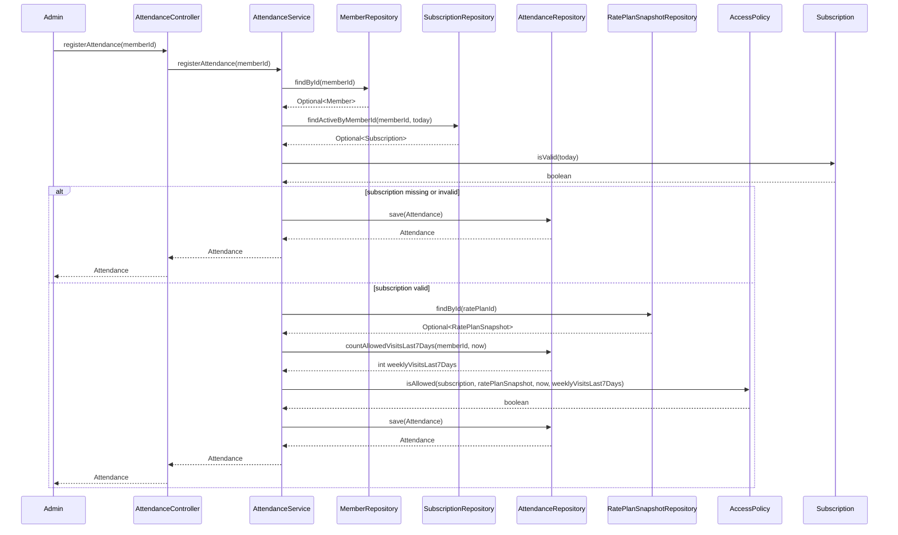

```mermaid
sequenceDiagram
participant Admin
participant AttendanceController
participant AttendanceService
participant MemberRepository
participant SubscriptionRepository
participant AttendanceRepository
participant RatePlanSnapshotRepository
participant AccessPolicy
participant Subscription

Admin->>AttendanceController: registerAttendance(memberId)
AttendanceController->>AttendanceService: registerAttendance(memberId)

AttendanceService->>MemberRepository: findById(memberId)
MemberRepository-->>AttendanceService: Optional<Member>

AttendanceService->>SubscriptionRepository: findActiveByMemberId(memberId, today)
SubscriptionRepository-->>AttendanceService: Optional<Subscription>
AttendanceService->>Subscription: isValid(today)
Subscription-->>AttendanceService: boolean

alt subscription missing or invalid
  AttendanceService->>AttendanceRepository: save(Attendance)
  AttendanceRepository-->>AttendanceService: Attendance
  AttendanceService-->>AttendanceController: Attendance
  AttendanceController-->>Admin: Attendance
else subscription valid
  AttendanceService->>RatePlanSnapshotRepository: findById(ratePlanId)
  RatePlanSnapshotRepository-->>AttendanceService: Optional<RatePlanSnapshot>

  AttendanceService->>AttendanceRepository: countAllowedVisitsLast7Days(memberId, now)
  AttendanceRepository-->>AttendanceService: int weeklyVisitsLast7Days

  AttendanceService->>AccessPolicy: isAllowed(subscription, ratePlanSnapshot, now, weeklyVisitsLast7Days)
  AccessPolicy-->>AttendanceService: boolean

  AttendanceService->>AttendanceRepository: save(Attendance)
  AttendanceRepository-->>AttendanceService: Attendance
  AttendanceService-->>AttendanceController: Attendance
  AttendanceController-->>Admin: Attendance
end
```